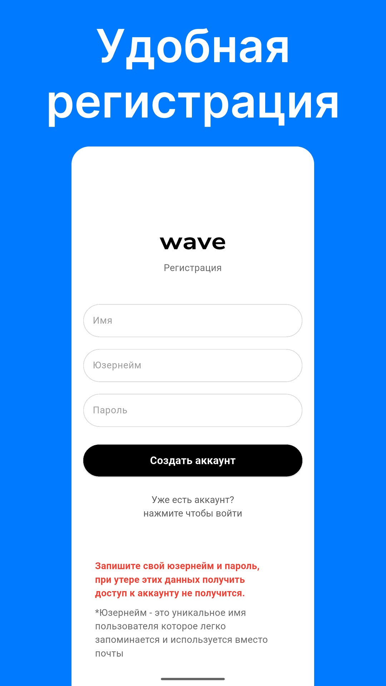
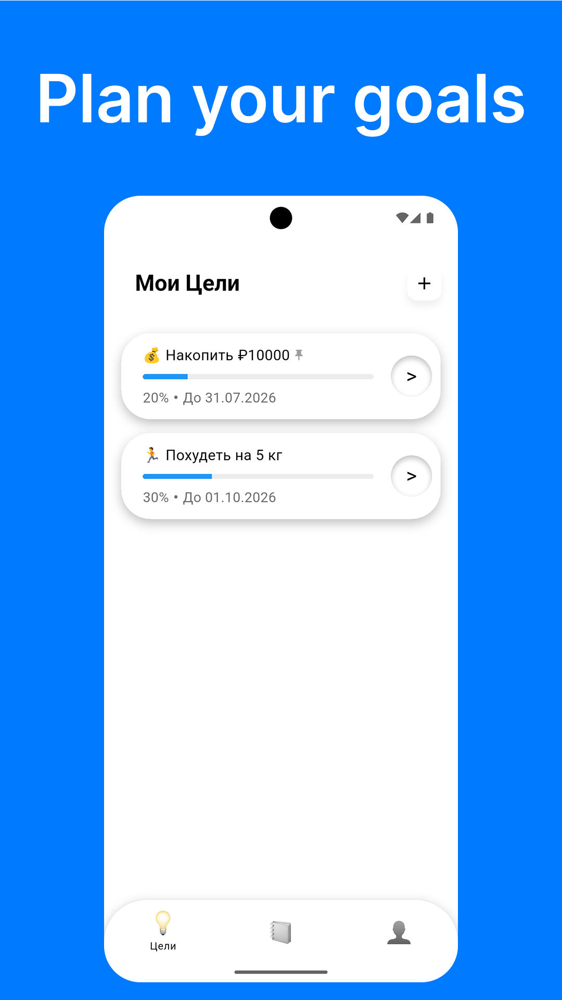
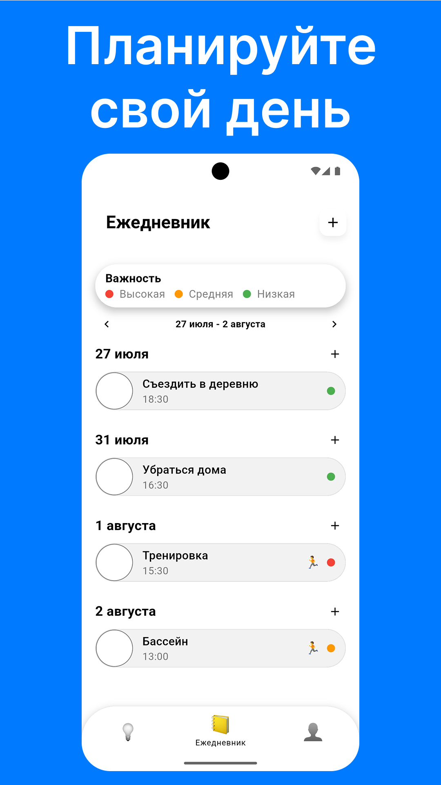
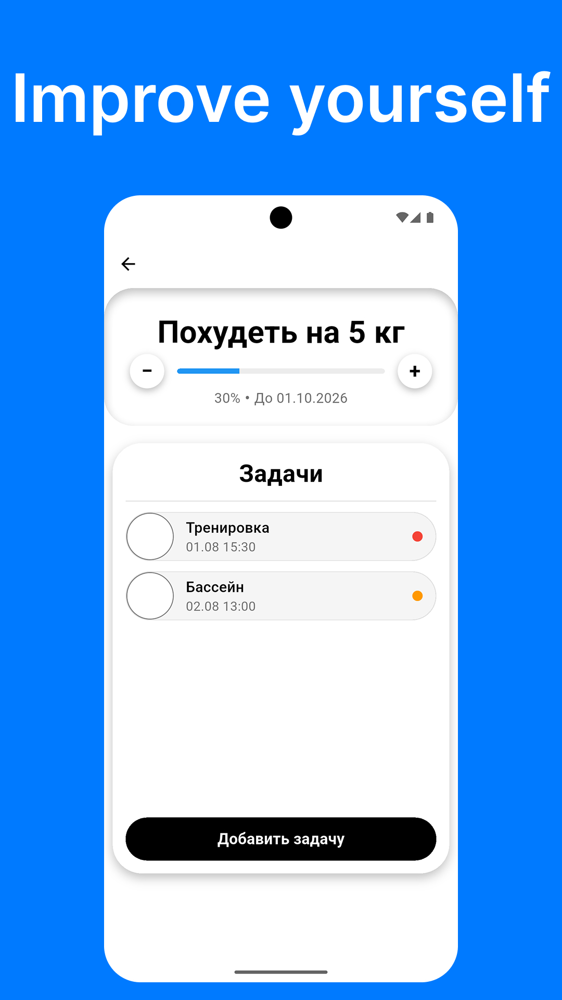
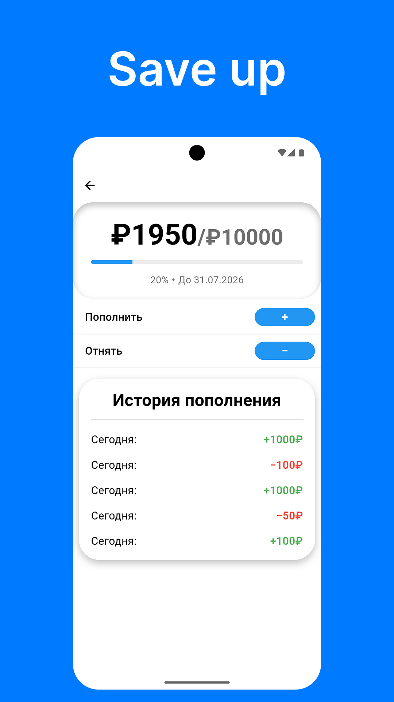

# 🌊 wave

> **Fast. Simple. Confidential. Offline-First.** Everything you need in one app.

---

## 📥 Download App

---

## 📸 Screenshots

||||||
|:---:|:---:|:---:|:---:|:---:|
| **Registration** | **Goals** | **Planner** | **Regular Goal** | **Money Goal** |

---

## ✨ Key Features

### 🎯 Goal Tracking
* 📌 **Regular Goals:** Set any goal with a target date, assign custom emojis, adjust overall progress manually, and create nested subtasks with reminders.
* 💰 **Money Goals (Savings Tracker):** Track your savings easily. Set target amounts, current savings, and target deadlines. Quickly add or subtract funds using `+` / `-` buttons, and view a history log of your 5 most recent transactions. *(Note: This feature is strictly for tracking purposes—no real financial transactions occur in the app).*

### 📅 Integrated Daily Planner
* 📋 **All Tasks in One Place:** View tasks created directly in the planner alongside subtasks linked to regular goals.
* 🏷 **Goal Emojis:** Tasks linked to a specific goal display that goal's custom emoji for easy context.
* 🚦 **Priority Filter:** Organize workload using 3 priority levels (*High*, *Medium*, *Low*).

### 🔔 Smart Reminders
* Set precise date and time notifications for any task to stay on top of your schedule.

---

## 🛡 Security & Offline Support

* 🔌 **Offline-First Engine:** Fully functional without an internet connection. Once online, local changes automatically sync with the server.
* 🔐 **wavesafe:** Advanced data protection utilizing **ws1.0** end-to-end encryption and strict minimal data collection policies.

---

## 🛠 Tech Stack

* **Framework:** [Flutter](https://flutter.dev) (Dart)
* **Architecture:** Offline-First Data Sync
* **Encryption Standard:** wavesafe (ws1.0)

---

## 📄 Copyright & License

**© 2026 WAVES Company. All Rights Reserved.**

All source code, designs, and assets are the intellectual property of **WAVES Company**. Unauthorized copying, distribution, or modification of this project, in whole or in part, without prior written permission is strictly prohibited.
